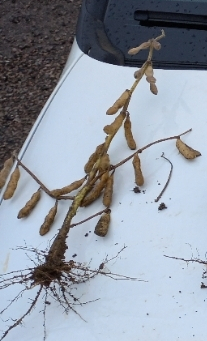
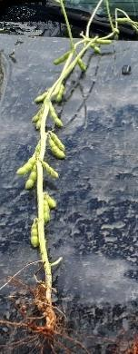
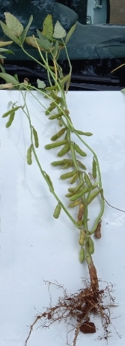

<h1 align="center">
        
</h1>

        
        
        
        

<h2 align="right">
           
        
</h2>
            

# Index 📎

- [Index 📎](#index-)
- [Sobre 📚](#sobre-)
- [Product Backlog 📍](#product-backlog-)
- [User Backlog 📄](#user-backlog-)
- [Calendário de Entregas 🗓](#calendário-de-entregas-)
- [Projeto em Operação 📱](#projeto-em-operação-)
- [Equipe 👩‍💻👨‍💻](#equipe-)

# Sobre 📚

O projeto constitui a adição de uma nova ferramenta para um aplicativo feito em outro projeto integrador para a Visiona. Nesta ferramenta era necessário ir a campo contar vagens e grãos para seu uso e isso exigia muito tempo do agricultor, surgiu a ideia de criar uma ferramenta com inteligência artificial para a contagem automática e visual desses grãos e esta é a ferramenta requisitada para nosso grupo.

# Product Backlog 📍

        

Você também pode visualizar o *Product Backlog* de cada sprint clicando [aqui](https://docs.google.com/spreadsheets/d/1kvREkN38lj2lWdEc1EylQo3yAcwkrQTZlOtGEeqNCi8/edit?usp=sharing)

# User Backlog 📄

Mudanças que afetam o usuário serão implementadas nas sprints seguintes.

  
# Calendário de Entregas 🗓
    
| Sprints    | About                                              | Datas         |
| ---------- | -------------------------------------------------- | ------------- |
| `Sprint 0` | Construção do roadmap do projeto                   | 15/08 a 19/08 |
| `Sprint 1` | Modelo inicial de reconhecimento de vagens de soja | 29/08 a 18/09 |
| `Sprint 2` | A ser desenvolvido                                 | 19/09 a 09/10 |
| `Sprint 3` | A ser desenvolvido                                 | 17/10 a 06/11 |
| `Sprint 4` | A ser desenvolvido                                 | 07/10 a 27/11 |
        
# Projeto em Operação 📱

  Resultado do modelo da IA treinado para identificar vagens de soja presentes na planta:

  

  
  
  

  

  
  
  

  

  
  
  

  

        É possível identificar que no momento nossa Inteligência Artificial não é capaz de reconhecer todas as vagens presentes na planta, demonstrando que o modelo ainda necessita de melhorias que serão implementadas nas próximas Sprints.
  

        
# Equipe 👩‍💻👨‍💻

<body>
        

                <table>
                <thead>
                        <th>Scrum Master</th>
                        <th>Product Owner</th>
                        <th>Dev Team</th>
                        <th>Dev Team</th>
                        <th>Dev Team</th>
                        <th>Dev Team</th>
                        <th>Dev Team</th>
                        <th>Dev Team</th>
                <thead>
                <tbody>
                        <tr>
                                <th></th>
                                <th></th>
                                <th></th>
                                <th></th>
                                <th></th>
                                <th></th>
                                <th></th>
                                <th></th>
                        </tr>
                        <tr>
                                <th></th>
                                <th></th>
                                <th></th>
                                <th></th>
                                <th></th>
                                <th></th>
                                <th></th>
                                <th></th>
                        </tr>
                <tbody>
        </table>
        

</body>
